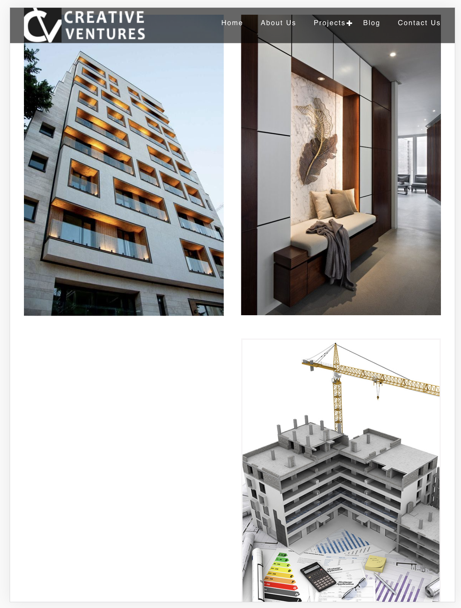
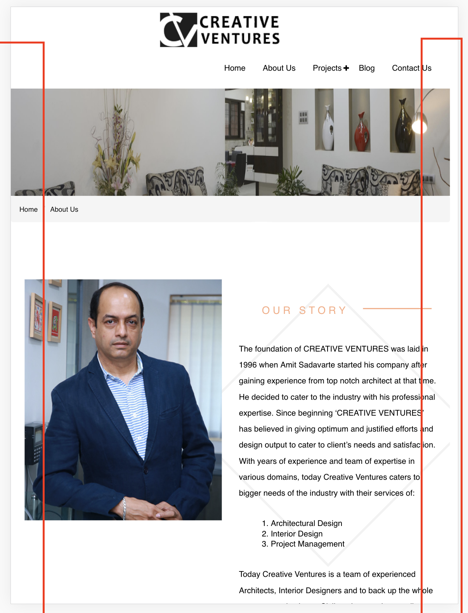
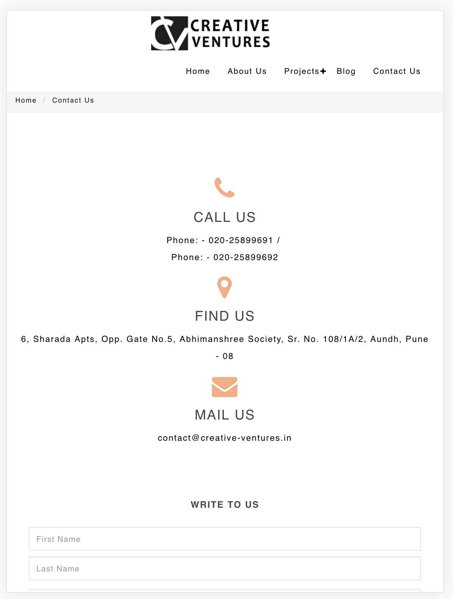

# Problems with `creative-ventures.in`

This contains a list of design and technical problems with the website- `creative-ventures.in`

## Problems by Page
### Home/Index
1. Misspelled word
    - _SCROOL DOWN_ instead of *Scroll Down* on `/index.html`

2. Mismatching fonts
    - The fonts on carousel on `/index.html` as a style mismatch with the font styling on the rest of the page.
    - The font for the numbers in the `Counter Area` on `/index.html` mismatches with the rest of the font styling.

3. Errors in loding content
    1. Page failed to load image and contents on `/index.html`. 

4. Improper Alignment
    - On `/index.html` the Tablets version of the website does not properly align the 3 elements. The 3rd element is off-set to the right where as it should either be centered or the 3 elements should be resized to fit on the same line. 
    - Similar problem with the _Work Process_ element. The 5th element needs to centered.

5. Font Sizing errors
    - On `/index.html` the font size for the numbers in `Counter Area` becomes smaller than the text for Tablets and Mobile versions where as it should be bigger like it is in the Desktop versions.

### About
1. Ugly letter Spacing
    - Multiple occurances of use of additional `letter-spacing` for paragraph elements on `/about.html`. The additional letter spacing makes that part look extremely ugly and there are multiple other ways to highlight certain text without making it look like a misfit.

2. Improper scaling
    - The page does not scale properly for smaller screen sizes. There are certain elements on the page which cause it to become a bit wider on the right side causing a small gap. 

### Projects - All 3 pages    
1. Grid Issues
    - The grid sizing is not optimal. It is causing the images to stretch from landscape to portrait on Mobile and Tablets.

### Contact
1. Grid Issues
    - The grid is not optimized for tablet devices and as a result displays the content upoptimally.  The 3 elements could fit inline with some optimization.

### Other Misc. Problems
1. Poor loading performance
 - The performance for the mobile version of the website is poor (~73/100) on Google Page Speed Insights
 - Report
    - Home- [link](https://developers.google.com/speed/pagespeed/insights/?url=http%3A%2F%2Fcreative-ventures.in%2F&tab=mobile)
    - About- [link](https://developers.google.com/speed/pagespeed/insights/?url=http%3A%2F%2Fcreative-ventures.in%2Fabout-us%2F&tab=mobile)
    - Project- [link](https://developers.google.com/speed/pagespeed/insights/?url=http%3A%2F%2Fcreative-ventures.in%2Farchitectural-projects%2F)
    - Contact- [link](https://developers.google.com/speed/pagespeed/insights/?url=http%3A%2F%2Fcreative-ventures.in%2Fcontact-us%2F)

2. Redundant Pages
    - The page `/blog.html` is not used and is completely redundant. All mentions of the page from the navbars must be removed and also the footer section which highlights blog posts is unnecessary.

3. Improper Alignment of Navbar
    - The navbar is not properly aligned in the tablet version of the website 
